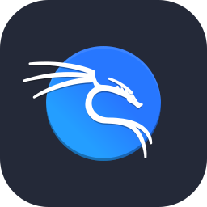
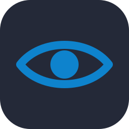
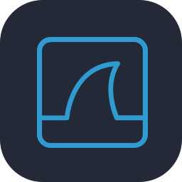
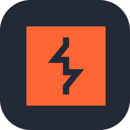
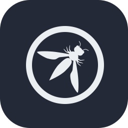

 

 

## About

Aspiring penetration tester focused on **cloud and network security**. I'm building hands-on experience in AWS security assessment, network penetration testing, and binary exploitation through labs, CTF competitions, and independent study.

My approach is methodical: understand how a system is designed to work, identify the assumptions it relies on, then test whether those assumptions hold.

- **Currently learning:** AWS privilege escalation, network pivoting, and heap exploitation
- **Open to:** CTF teams and collaboration on cloud security research
- **Ask me about:** AWS security, network pentesting, CTFs, and pentest methodology

 

## Focus Areas

<table>
<tr>
<td width="33%" valign="top">

### ☁️ Cloud Security
**AWS**

- IAM misconfigurations
- S3 exposure
- Privilege escalation paths
- Lateral movement in cloud

</td>
<td width="33%" valign="top">

### 🌐 Network Pentesting
**Internal & External**

- Reconnaissance & enumeration
- Pivoting & tunneling
- Lateral movement
- Post-exploitation

</td>
<td width="33%" valign="top">

### 🧬 Binary Exploitation
**CTF / Pwn**

- Stack overflows
- ROP chains
- Format strings
- Heap exploitation *(next)*

</td>
</tr>
</table>

 

## Methodology

`Recon` &nbsp;→&nbsp; `Enumeration` &nbsp;→&nbsp; `Exploitation` &nbsp;→&nbsp; `Privilege Escalation` &nbsp;→&nbsp; `Pivoting` &nbsp;→&nbsp; `Reporting`

 

## Tech Stack

 

## Security Toolbox

 

## CTF & Labs

 

## GitHub Activity

 

*"Human nature has no patch."*

